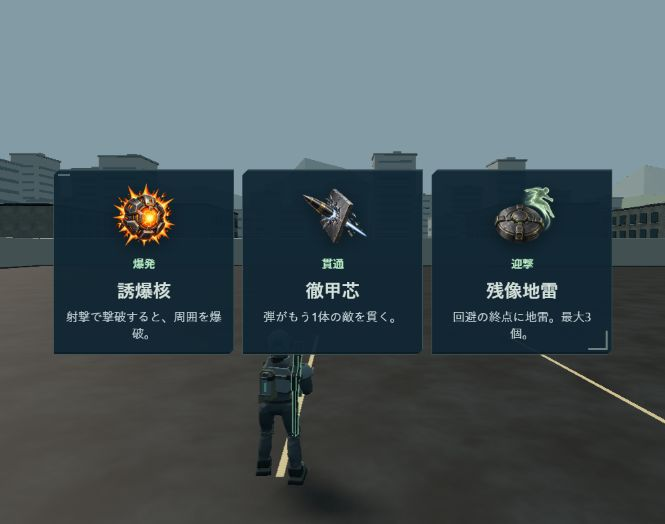

# 3択の中央コンパクト表示・即時再開の公開記録（2026-10-03）

[改装版](https://swarm-front.melosalife-24.workers.dev/front)へ公開済み。「まもなく再開」の待ち表示を撤去し、選択したカードが光る200msの演出だけで戦闘へ復帰する。3択は背景の戦場を見せたまま、中央の小さな3枠に表示する。一時停止からの追加1秒待ちも撤去。従来HUD・操作配置・旧版・保存仕様・生成アイコン・敵4倍/HP半分を維持。

## ソースと監査

- GitHub `https://github.com/futsalife24-bot/swarm-front`、作業場所 `C:/Users/futsa/Documents/Codex/2026-10-02/github/swarm-rebuild-p1a`。
- 作業branch `codex/front-choice-tempo-20261003`、base `307d3769f2b45f3d4886733a95fbcbe03323e9df`。
- 実装 `91cb1c16fa86ecda8bf372cdeb418ddf5d7c9b15`、固定監査対象 `ce154997a6dd46f0eceaebd360ab0e19f8825ff4`、PR最終head `eb9bbb88fe1f439e7b253d4ae9ee8f7fd4584ce2`。
- [PR121](https://github.com/futsalife24-bot/swarm-front/pull/121)を通常merge。公開ソースmain `222664c38bf43dffd082b3cdee53ba6c95b3b589`。
- [通常Chat](https://chatgpt.com/c/6ac0bc1f-4878-83ee-af08-3c2555c82e04)独立監査は合格、必須P0/P1/P2なし。[完結した本文](evidence/front-choice-20261003/audit-final.txt)を保存。
- 695ファイル全blob・差分逆適用・状態遷移・画像/実測/ログを独立照合。依存取得を行わず型/単体/実通信/実UI/buildの監査側再実行はしていない。
- 最終全文出力・コピー/再生成操作・停止操作消失を確認。末尾にUI通信エラーが併記されたためChat側永続保存は未確認。完結した独立判定をGit証拠へ保存して採用。以降は文書/証拠のみ。
- 任意提案の静止後スクリーンショットは公開版で補完。高遅延協力の旧候補が一瞬再表示する可能性は残るが、サーバーの古い候補/重複要求拒否は維持。全員の選択待ちと通信遅延は必要。

## 検証と公開

型チェック・改装版単体23件・実Worker2〜4人通信3件・実UI4件成功。横1280×720/844×390/640×360と実2人協力、選択演出・二重選択拒否・旧保存不変を確認。操作復帰は230.4〜267.1ms。[変更と自己検証](FRONT-CHOICE-TEMPO.md)。

公開mainからbuild/Worker dry-run成功。既存 `wrangler.production.jsonc` で公開し、Worker Version `373c26f7-cb3f-4bdb-ba3e-0697ce031b38`。health200/ok true、配信37ファイルのSHA256全一致。[配信照合](evidence/front-choice-20261003/delivery.json)。

公開ブラウザ665×524で3枠の静止後画像を保存。枠全体558.875×185.417、x53.229/y169.292で中央、背景透明。選択→待ち表示なしで従来HUD・ミニマップ・操作復帰→一時停止→追加待ちなしで同じ戦闘へ復帰→任務終了→メニュー復帰を確認。実行エラー0。初回の停止クリックは表示名の完全一致を誤り見つからなかったため、現在の画面で「一時停止（Esc）」を確認して操作した。無操作の確認中に17秒で部隊全員ダウンし、終了処理と報酬も正常。

物理Android/ジャイロ/97体FPS・人間の体感は未確認。主担当1体、実モデル/effort未確認、切替なし。公開後の記録は文書/証拠だけの通常PRでmainへ保存し、コード変更・再公開は不要。
