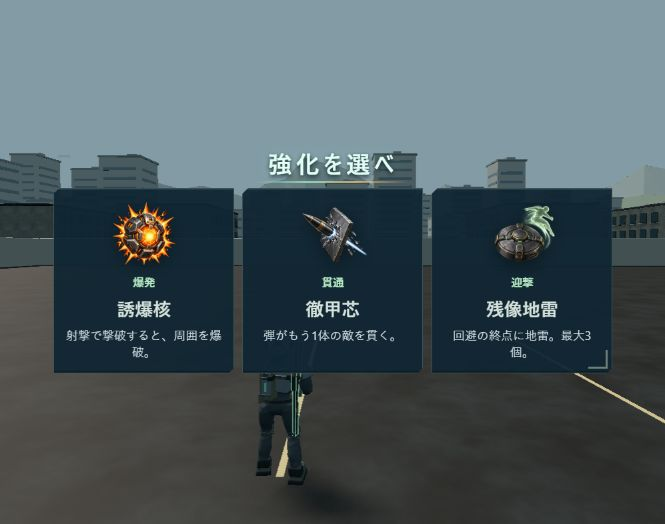

# 強化見出し・取得状況の公開記録（2026-10-03）

[改装版](https://swarm-front.melosalife-24.workers.dev/front)へ公開済み。中央3択の上に「強化を選べ」を太字/斜体の既存見出し書体で表示し、文字の収束と光線の短い演出を追加。戦闘中は小さな取得済みアイコンと段階、一時停止中は名称・段階・合計効果・発動中の進化を確認できる。狭い画面では詳細だけをスクロールし、再開/設定/退出は常に操作可能。

## ソースと独立監査

- GitHub `https://github.com/futsalife24-bot/swarm-front`、ローカル `C:/Users/futsa/Documents/Codex/2026-10-02/github/swarm-rebuild-p1a`。
- branch `codex/front-upgrade-status-20261003`、base `84ad310bb38559026521b33411ecdf014c9207fb`。
- 初回実装 `1da34ca82c6f8d6289df1ea080f3944dde63e954`、初回監査対象 `2c175a6d04f3c61bb545fea393b7adaf3438dd96`。
- [通常Chat](https://chatgpt.com/c/6ac0cafa-6284-83ee-a646-a20f333c3781)のP2は装甲補強の回復条件説明。「生存中の取得時は増加分を回復」へ修正し、対象 `c2af40c2522aeda6ed62e35187beb78de2a79bf4` の限定再監査は合格、P0/P1/P2なし。[確定判定](evidence/front-upgrade-status-20261003/audit-final.txt)。
- 最終PR head `2aabab3bdc4f3baad7b1c1391beb4416dacc4c7c`、監査後は文書/証拠のみ。[PR123](https://github.com/futsalife24-bot/swarm-front/pull/123)を通常merge、公開ソースmain `226074ac46c0bab6e54da3443b6a721d10ecc0f7`。
- 初回714/修正版9ファイルのhash/blobを監査側でも全一致確認。コード/直接依存・状態条件・PNG/ログを独立照合。依存取得とテスト再実行は監査側では未実施。最終回答完了・コピー/再生成操作を確認し本文を保存。

## 検証・配信

型チェック、表示単体4件、実UI4件（1280/844/640と実Worker2人協力）、タッチ旧HUD比較2件成功。単体4件は説明修正後、型と実UI6件は説明1行修正前の検証。状態/通信/保存は変更していない。7強化/2進化と7アイコン1行の境界は合成状態での描画検証であり、実プレイでの取得証拠とは区別。

公開mainからbuild/Worker dry-run成功。既存 `wrangler.production.jsonc` で公開。Worker Version `3b06c5d7-3e6b-4d14-8a46-40befb074326`。health200/ok true、配信37ファイルのSHA256全一致。[照合結果](evidence/front-upgrade-status-20261003/delivery.json)。

公開ブラウザで見出し「強化を選べ」・`front-title-enter`・既存見出しフォントを確認。選択演出後の戦闘復帰→小アイコン「誘爆核」→一時停止の名称/効果/取得数→メニュー復帰を確認。実行エラー0。公開画面3枚を保存。公開UIで装甲補強を実取得する確認はしておらず、修正済み本文の配信一致と単体テストで確認した。

[戦闘中](evidence/front-upgrade-status-20261003/public-battle.png)・[一時停止中](evidence/front-upgrade-status-20261003/public-pause.png)・[実装と検証の詳細](FRONT-UPGRADE-STATUS.md)。

前回の200ms選択確定演出/即復帰、従来HUDと操作配置、旧版を維持。物理Android/人間の体感と、任意提案の640幅追加補給「見出し＋期限＋再抽選」の直接E2Eは未確認。主担当1体、実モデル/effort未確認、切替操作なし。公開記録を文書/証拠だけの通常PRでmainへ保存し、コード変更/再公開は不要。
