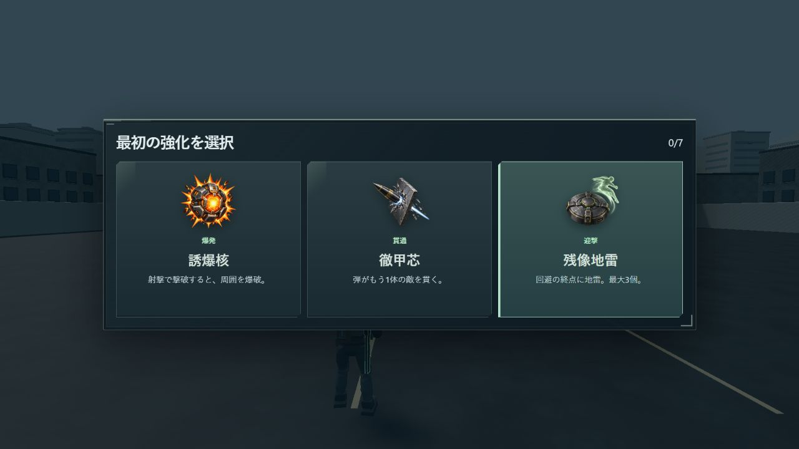
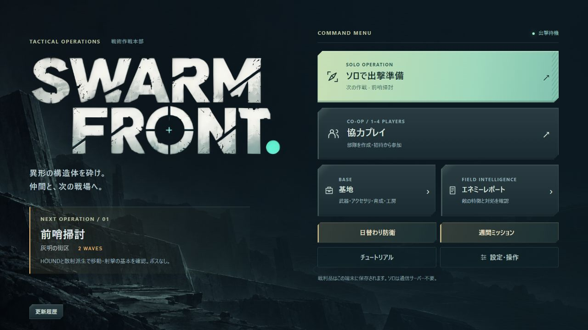

# 大改装版の公開記録（2026-10-03）

旧版を保護して、大改装版を既存Workerへ公開した。

- [大改装版で遊ぶ](https://swarm-front.melosalife-24.workers.dev/front)
- [従来の遊び方へ戻る](https://swarm-front.melosalife-24.workers.dev/)
- [実装PR115](https://github.com/futsalife24-bot/swarm-front/pull/115)
- [旧版保護ブランチ](https://github.com/futsalife24-bot/swarm-front/tree/preserved/pre-rebuild-20261002)

## 対象と独立監査

公開ソース: `2bdacb361ccc6b5c57e2df97bb4a2f01485091cf`（PR115の通常merge）。Worker Version: `f5e2f965-999a-4599-bd94-fea836d7d9e2`。設定は既存の `wrangler.production.jsonc` を使用し、サービス・移行・権限設定を追加していない。

[同じ通常Chat](https://chatgpt.com/c/6ac069d4-ba90-83ec-b522-18d3c42a88da)の最終限定再監査は `be070dc85f230f856851e414d23f350fe2953338` を合格、F1解消、必須P0/P1/P2各0件と判定。監査後からPR最終head `d3e9397eb415b90e90e57e9a1298ef1ba706cb20` までは文書と証拠だけ。merge treeはそのheadと一致した。[合格報告](evidence/rebuild-p1a/front-f1-20261003/audit-pass.txt)・[修正と検証](REBUILD-PLAYABLE-F1.md)。

統合時はmain・head・merge可能状態を照合し、通常mergeを使用した。mainのbranch protection無効・rulesets 0件・checks/statuses 0件を確認したが、CI合格とは扱っていない。管理者バイパス・保護変更なし。

## 公開と配信照合

cleanな公開ソースから配信ビルドとWorker dry-runが成功し、既存Workerへの公開が成功した。実配信のhealthはHTTP 200、`ok=true`、WebSocket・Durable Objectの応答。HTML2種、SW、全配信JS/CSS、生成強化アイコン12枚、標準隊員GLBを合わせた37ファイルがビルド出力のSHA256と全一致、不一致0件。[配信照合JSON](evidence/rebuild-p1a/release-20261003/public-delivery.json)。

Pythonの標準HTTP取得は403を返したため、セキュリティ設定を変更せずPowerShellの標準HTTPクライアントで正常取得して照合した。ビルド・dry-run・公開ログはGit外の `../.task-tools/front-release-build-final-20261003.log`、`front-release-worker-build-final-20261003.log`、`front-release-deploy-20261003.log` に保存。末尾にfinalがない以前のビルドログは公開の合格証拠として使用していない。

## 公開画面

実公開ブラウザでソロ準備→初期3択→強化選択→戦闘開始→一時停止→出撃メニューへの退出を確認した。初期3枚の生成画像は各256×256で読込完了、短い日本語説明と一緒に表示。カードの表示アニメーションは380ms、遅延0/70/140ms。3択の下に操作・停止の案内はない。結果確定や旧保存のリセット・移行は操作していない。

ホームの「旧版で遊ぶ」で従来の `/` へ遷移し、旧版の開始入口を確認。旧中断作戦・所持品を書き換える操作はしていない。旧主要10ファイルのblob保持は[旧版保護表](evidence/rebuild-p1a/front-20261002/legacy-protection.json)と独立監査で確認済み。新進行は別保存キー・別協力ルールで分離している。

## 新PCのGit追跡補正

cloneの追跡対象にmainがなかったため、既存originへ `refs/heads/main:refs/remotes/origin/main` を追加した。remote URLは変更なし。[設定前後ハッシュ](evidence/rebuild-p1a/release-20261003/main-tracking.json)。

初回のmain追跡切替が失敗し、indexだけ旧baseのtreeになった。公開前に停止して確認したところ、staged 102件・unstaged 0件、index tree `33d68cf8716ec943e2e04f628e4fc28d77325bc5` は保存済み旧baseと完全一致。HEADと監査済みPR headのtreeは共に `974529719db58b5e2f77dfd2b64f9a3299a50428`。Git外へ差分を保存し、別の未保存変更がないことを確認した上でHEADからindex/作業ファイルを復元し、cleanから最終ビルド・公開した。履歴・未追跡物・認証値の削除なし。

## 検証の限界と引継ぎ

全体の自己検証は[検証記録](REBUILD-PLAYABLE-VALIDATION.md)、F1後の実非表示タブ・通常3画面・旧試作6件の確認は[修正記録](REBUILD-PLAYABLE-F1.md)。独立監査側が全ビルド/E2Eを再実行したという意味ではない。物理Android、人間の難易度・楽しさ、実ネット越し4人、既存端末の旧SW更新は未確認。既存Stage25の失敗は旧baseでも再現済み。新進行のクラウド同期・旧保存移行は今回実装していない。

公開記録のmain反映は文書と証拠だけの通常PRで行う。公開ソースSHAと、その後の記録merge SHAは区別する。配信コードの差分がないため記録だけで再公開しない。実行モデル/effortは取得できず未確認、切替なし、主担当1体。
